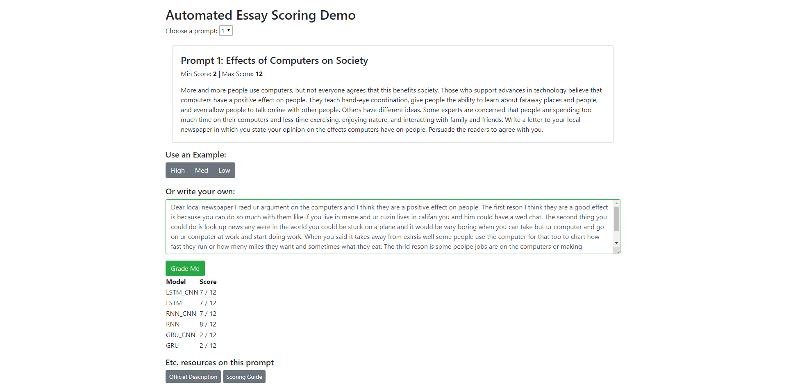
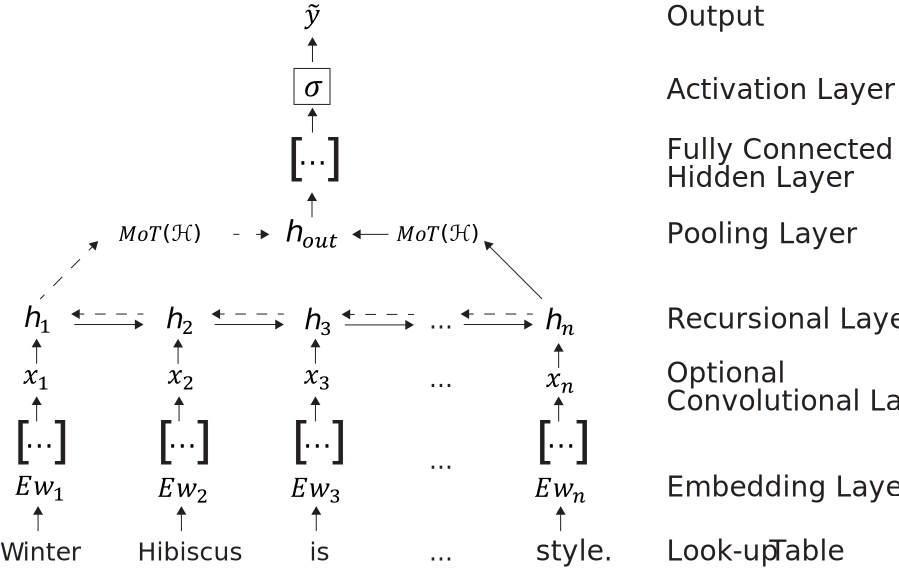

# CAS: The Comparative Automated Scoring Model
Code for "[A Comparison of Training Models on the Accuracy of Artificial Essay](https://linkhere)".

## Requirements

To install the required dependencies: 
- `cd` to the project folder
- Run `pip install requirements.txt` 

The dataset and GloVe embedding are too large to include in the project. If you want to import them, please download them seperatly and put them in the `ComaprisonAES/data` directory:
- [Training Data](https://www.kaggle.com/c/asap-aes/data)
- [GloVe Embedding](https://nlp.stanford.edu/projects/glove/). (Note: the 300d embedding is used in the paper)

## Using the Jupyter Notebooks
This project is split into 4 different Jupyter notebooks:

- `pipeline.ipynb` is an easy-to-use pipeline which evaluates 5-fold models
- `Feature Selection.ipynb` extracts features and generates a `*.pkl` represenatation for the dataset to be used in supervised models
- `Regression Models.ipynb` is used to train supervised models, drawing from their `*.pkl` generated representation
- `Neural Models.ipynb` is used to develop the pipeline for each type of unsuprvised network

These notebooks also use helper python functions, stored in the `ComparisonAES/utils` folder:
- `customLayers.py` contains custom Mean over Time and Attention pooling layers for Keras
- `customUtils.py` contains various helper functions for preprocessing and getting various layers for unsupervised networks
- `pipeline.py` allows for essays to be individually tokenized to support the web demo

## Web Demo Served through Django

To start the web demo,
- cd to the `ComparisonAES/mysite` folder
- Run `python manage.py runserver`
- Navigate to `http://localhost:8000/` in your browser

The server uses models stored in a `*.h5` format. To use your own models, place them in the `ComparisonAES\mysite\evaluator\models\draft` folder using the format `[model name]_[prompt ID]_model.h5` or `[model name]_[prompt ID]_weights.h5` for models and thier weights respectfully.

## Notes & Etc.
Here is the scematic on the architecture of the unsupervised models:

